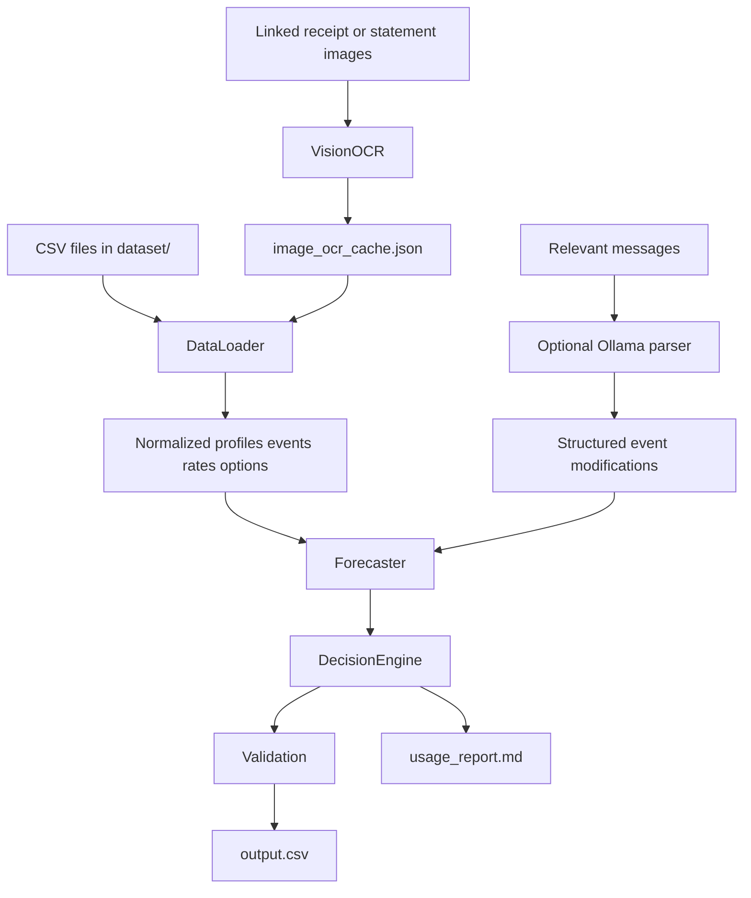

# System Architecture

## 1. Purpose

**Buy or Wait?** is a deterministic financial decision agent for the HackerRank Orchestrate hackathon. It processes every request in `dataset/requests.csv` and writes one safe, explainable recommendation per request to the root `output.csv`.

The system answers five practical questions:

1. How much can the user safely pay on the request date?
2. Can the full amount be paid now?
3. If not, can an allowed plan complete the request safely and by the deadline?
4. When could the full amount first be paid safely?
5. Should the user avoid the transaction when no safe eligible plan exists?

The financial rules and forecast are authoritative. OCR and language models only extract supporting evidence.

## 2. High-Level Flow



## 3. Runtime Components

### `code/main.py`

The application entry point. It:

1. Creates the usage tracker.
2. Creates `VisionOCR` and passes it to `DataLoader`.
3. Loads and normalizes all challenge data.
4. Creates the `Forecaster` and `DecisionEngine`.
5. Optionally applies structured message amendments from a local Ollama model.
6. Generates and validates one decision per request.
7. Writes the required root-level `output.csv`.
8. Writes `code/evaluation/usage_report.md`.

### `code/data_loader.py`

Loads the CSV inputs and prepares the financial ledger. Its important ordering is:

1. Read profiles, events, requests, payment options, rates, messages, and image links.
2. Convert date columns.
3. Resolve blank event amounts from linked image OCR records.
4. Convert foreign-currency event amounts to each user's home currency.

A blank amount is never treated as zero. If the linked image has a successful cached OCR record, that amount is inserted into the event before forecasting.

### `code/vision_ocr.py`

Wraps Google Cloud Vision text detection. It:

- reads linked files from `dataset/media/images/`
- extracts text and a relevant amount
- prioritizes salary `Net Pay` and transferred salary values
- handles multi-line receipt totals and water-bill layouts
- saves successful records in `image_ocr_cache.json`
- reuses cached records on later runs

Vision does not decide affordability and does not invent financial events.

### `code/forecaster.py`

Reconstructs a user's financial state and simulates the next 90 days. It accounts for:

- current available balance
- the user's minimum balance
- settled, pending, scheduled, failed, and cancelled event states
- confirmed income on settlement dates
- recurring obligations inferred from supported history
- essential and flexible spending
- candidate payment plans

A plan is safe only when the projected balance stays above the required minimum throughout the forecast.

### `code/decision_engine.py`

Generates and ranks candidates for:

- full payment
- partial payment
- supplied installments
- waiting for a safe full payment date
- not recommending the transaction

It respects the user's accepted payment methods, partial-payment permission, installment limits, request deadline, supplied payment options, and forecast safety checks.

### `code/local_message_parser.py`

Calls the configured local Ollama model, currently `llama3.2`, to extract explicit event changes from relevant messages. It may return only structured `cancel`, `amend`, or `confirm` actions with explicit event IDs and values.

The model does not choose the recommendation, calculate affordability, or override challenge rules. Results are cached in `message_parser_cache.json`.

### `code/evaluation/tracker.py`

Tracks token-metered model calls and generates the required usage report. Google Vision OCR is reported as evidence extraction separately because its API does not expose LLM token counts. The final report must describe the actual run that produced `output.csv`.

## 4. Data Contracts

### Inputs

The loader reads:

- `dataset/requests.csv`: evaluation requests; one output row per `request_id`
- `dataset/financial_profiles.csv`: balances, minimum reserves, priorities, protected categories, and preferences
- `dataset/financial_events.csv`: historical and forecast-relevant cash events
- `dataset/exchange_rates.csv`: fixed dated conversion rates
- `dataset/request_payment_options.csv`: seller/provider payment plans
- `dataset/messages.csv`: supporting event evidence
- `dataset/images.csv`: links images to users, requests, and events
- `dataset/media/images/`: image files used by OCR

`sample_requests.csv` is for understanding format and decision style only. It is not used as evaluation labels.

### Output

The root `output.csv` must contain exactly these columns, in this order:

```text
request_id,amount_safe_to_pay,affordability_status,recommended_payment_method,payment_plan,earliest_date_for_full_payment,spending_changes_needed,decision_explanation
```

The runner produces exactly one row for every request in `dataset/requests.csv`.

## 5. Decision Rules

The implementation follows this order:

1. Reconstruct the user's financial state.
2. Reserve required and pending debits; do not count unsettled credits or unrealized value.
3. Resolve linked image and message evidence without letting it override challenge rules.
4. Simulate each candidate plan across the 90-day forecast.
5. Reject plans that breach the minimum balance, miss the deadline, violate preferences, or do not match a supplied option.
6. Rank safe candidates by deadline completion, no spending changes, total cost, start date, number of payments, and payment-option ID.
7. Validate bounds, enums, dates, totals, and output schema before writing the file.

The deterministic engine remains authoritative even when OCR or Ollama is enabled.

## 6. Caching and Repeatability

- OCR results: `image_ocr_cache.json`
- Local message results: `message_parser_cache.json`
- Final predictions: `output.csv`
- Usage report: `code/evaluation/usage_report.md`

Caching reduces repeated Vision and Ollama calls. The core decision logic is deterministic for the same input files, cache contents, and configuration.

## 7. Run Modes

### Deterministic submission run

```powershell
python code/main.py
```

This uses cached OCR evidence when available and keeps LLM explanations disabled by default.

### Google Vision setup

```powershell
gcloud auth application-default login
python code/main.py
```

The Google Cloud client reads credentials from the normal Application Default Credentials chain. Never commit credentials or API keys.

### Optional local message extraction

```powershell
ollama pull llama3.2
$env:LOCAL_LLM_MODEL = "llama3.2"
$env:ENABLE_LLM_MESSAGES = "1"
python code/main.py
```

Use a Qwen model by changing `LOCAL_LLM_MODEL`. The local model extracts message facts only; it never makes the financial decision.

## 8. Submission Checklist

Before packaging the challenge submission:

- run `python code/main.py`
- confirm root `output.csv` exists
- confirm one output row per request
- confirm the required columns and allowed enum values
- confirm safe amounts stay between zero and the requested amount
- inspect `code/evaluation/usage_report.md`
- include the runnable code and evaluation folder in `code.zip`
- exclude API keys, credential files, `.env`, and private configuration
