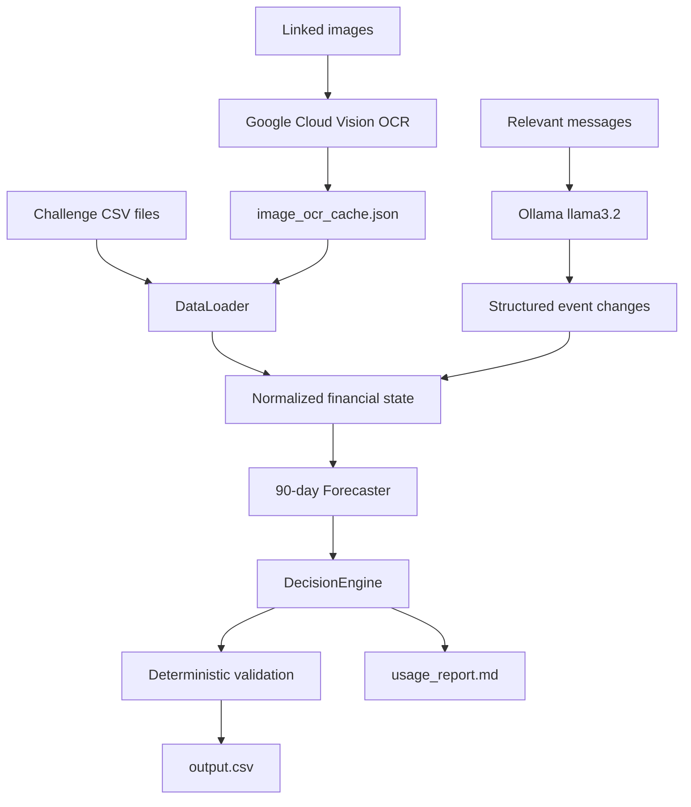

# Buy or Wait? Financial Decision Agent

An AI-assisted financial decision agent built for the **HackerRank Orchestrate** hackathon.

The agent answers a practical question for every request in the challenge dataset:

> Can this user safely make this payment, and what is the safest way to complete it?

It reconstructs each user's financial state, reads supporting evidence from receipt images and messages, forecasts the next 90 days, and recommends whether to pay in full, pay partially, use installments, wait, or avoid the transaction.

The final financial decision is deterministic and rule-based. Google Cloud Vision and local Ollama `llama3.2` provide structured evidence; they never override the financial safety rules.

## What This Project Does

For each row in `dataset/requests.csv`, the agent:

1. Loads the user's profile, balance, priorities, protected spending, and payment preferences.
2. Reconstructs the user's ledger from financial events.
3. Uses Google Cloud Vision OCR to recover amounts missing from linked images.
4. Uses local Ollama `llama3.2` to extract explicit cancellations, amendments, or confirmations from relevant messages.
5. Converts foreign-currency events using the supplied dated exchange rates.
6. Forecasts cash flow for 90 days.
7. Tests full payment, partial payment, installment, wait, and rejection candidates.
8. Rejects any plan that breaches the minimum balance, misses the deadline, violates preferences, or conflicts with supplied payment options.
9. Validates the result and writes one row to the root `output.csv`.

## Architecture



Read [`ARCHITECTURE.md`](ARCHITECTURE.md) for the detailed module-by-module design.

### Authoritative layer

The deterministic financial engine is the authority. It decides affordability, calculates safe amounts, builds payment plans, and validates the final output.

### Evidence layer

- **Google Cloud Vision OCR** extracts missing amounts from linked payroll slips, bills, receipts, and statements.
- **Ollama `llama3.2`** extracts only explicit message facts such as `cancel`, `amend`, and `confirm` actions.

Neither model is allowed to invent income, create payment options, or make the final affordability decision.

## Repository Structure

```text
.
├── README.md                         # This guide
├── ARCHITECTURE.md                   # Detailed architecture and data flow
├── problem_statement.md              # HackerRank challenge specification
├── Planning.md                       # Original implementation plan
├── code/
│   ├── main.py                       # End-to-end entry point
│   ├── config.py                     # Paths and output schema
│   ├── data_loader.py                # CSV loading, OCR filling, currency conversion
│   ├── vision_ocr.py                 # Google Vision OCR and JSON cache
│   ├── local_message_parser.py       # Ollama message extraction and cache
│   ├── forecaster.py                 # 90-day cash-flow simulation
│   ├── decision_engine.py             # Candidate generation and ranking
│   ├── utils.py                      # Date and utility helpers
│   └── evaluation/
│       ├── tracker.py                # Usage-report generation
│       └── usage_report.md           # Final run usage summary
├── dataset/                          # Challenge inputs
├── image_ocr_cache.json              # Successful OCR results
├── message_parser_cache.json         # Cached Ollama message results
├── output.csv                        # Final predictions
└── output_llama.csv                  # Preserved Llama-run output, when created
```

## Input Data

The agent reads the supplied files from `dataset/`:

| File | Purpose |
|---|---|
| `requests.csv` | Requests requiring predictions |
| `financial_profiles.csv` | User balances, minimum reserves, priorities, and preferences |
| `financial_events.csv` | Historical, pending, scheduled, settled, and non-cash events |
| `request_payment_options.csv` | Full-payment and installment options supplied by sellers/providers |
| `exchange_rates.csv` | Fixed date-specific currency conversion rates |
| `messages.csv` | Supporting messages linked to users, requests, or events |
| `images.csv` | Links image files to requests and financial events |
| `media/images/` | Receipt, bill, statement, and payroll images |
| `sample_requests.csv` | Public examples for understanding the output format |

`sample_requests.csv` is reference material, not evaluation labels. Organizer-only files are not used.

## Output Contract

The agent writes `output.csv` in the repository root with exactly these columns:

```text
request_id,amount_safe_to_pay,affordability_status,recommended_payment_method,payment_plan,earliest_date_for_full_payment,spending_changes_needed,decision_explanation
```

Allowed `affordability_status` values:

```text
affordable_now
affordable_with_plan
affordable_later
not_affordable
```

Allowed `recommended_payment_method` values:

```text
full_payment
partial_payment
installments
wait
not_recommended
```

Important output rules:

- `amount_safe_to_pay` must be between `0` and `requested_amount`.
- `payment_plan` uses chronological `YYYY-MM-DD:amount` entries joined with `|`, or `none`.
- An installment plan must match a supplied payment option.
- A partial-payment plan must contain exactly two payments and add up to the full requested amount.
- `earliest_date_for_full_payment` is empty when no safe full-payment date exists in the forecast.
- Spending changes may target only permitted flexible recurring expenses.
- There must be exactly one output row for every request ID.

## Financial Decision Logic

The forecast protects the user's financial position by:

- keeping the balance at or above `minimum_balance_to_keep`
- reserving pending and scheduled debits
- counting confirmed income only on its settlement date
- excluding pending credits and unrealized investment value
- ignoring failed and cancelled events
- using supported history to infer recurring obligations
- respecting protected categories and payment preferences
- requiring eligible plans to complete by `desired_completion_date`

Safe candidates are ranked by the challenge priorities: deadline completion, avoiding spending changes, lower total cost, earlier start, fewer payments, and payment-option tie-breaker.

## Setup

Requirements:

- Python 3.10 or newer
- Python packages used by the project, including `pandas`
- Google Cloud Vision SDK and credentials for live OCR calls
- Ollama with a local model for message extraction

Install the Python dependencies available in your environment, for example:

```powershell
python -m pip install pandas google-cloud-vision
```

Do not commit API keys, service-account files, `.env` files, or private credentials.

## Run the Agent

### Windows PowerShell

```powershell
$env:ENABLE_LOCAL_MESSAGES="1"
$env:LOCAL_LLM_MODEL="llama3.2"
python code/main.py
```

### macOS or Linux

```bash
export ENABLE_LOCAL_MESSAGES=1
export LOCAL_LLM_MODEL=llama3.2
python3 code/main.py
```

The command processes every request, writes `output.csv`, and generates `code/evaluation/usage_report.md`.

## Configure Google Cloud Vision

Google Vision is used when an event has a blank amount and an image is linked to that event through `images.csv`.

Authenticate with Application Default Credentials:

```powershell
gcloud auth application-default login
```

The extractor stores successful results in `image_ocr_cache.json`. Later runs reuse cached OCR results. The cache supports the linked dataset images and stores both extracted text and amounts.

The Vision client also supports the standard `GOOGLE_APPLICATION_CREDENTIALS` environment variable for service-account deployments. Never place credential paths or credential contents in source control.

## Configure Ollama and Llama

Start Ollama and install the local model:

```powershell
ollama serve
ollama pull llama3.2
```

Then run the agent with:

```powershell
$env:ENABLE_LOCAL_MESSAGES="1"
$env:LOCAL_LLM_MODEL="llama3.2"
python code/main.py
```

The message parser:

- sends only relevant message text and linked event context
- requests JSON containing explicit event modifications
- caches successful results in `message_parser_cache.json`
- ignores null or malformed optional fields safely
- never chooses affordability or payment plans

Qwen can be used by changing `LOCAL_LLM_MODEL` to an installed Ollama model, but the documented configuration uses `llama3.2`.

## Caches and Reports

| File | Meaning |
|---|---|
| `image_ocr_cache.json` | Cached Google Vision text and extracted amounts |
| `message_parser_cache.json` | Cached Ollama message modifications |
| `output.csv` | Final prediction file required by the challenge |
| `code/evaluation/usage_report.md` | Provider, call, token, and cost summary |
| `log.txt` | Development transcript required by repository instructions |

The usage report distinguishes model calls from deterministic processing. Google Vision OCR is reported as evidence extraction because its API does not expose LLM token counts. Ollama usage is reported by model when provider counters are available; cached runs without persisted provider counters are explicitly marked as estimated.

## Verification

After a run, check the output shape:

```powershell
python -c "import pandas as pd; d=pd.read_csv('output.csv'); print(len(d)); print(d.columns.tolist())"
```

For the current dataset, the expected result is:

```text
250 rows
250 unique request IDs
the exact required output columns
```

Also confirm:

- no request IDs are missing or duplicated
- safe amounts are within request bounds
- payment plans use valid dates and amounts
- the usage report describes the same run that produced `output.csv`
- no credentials or secrets are tracked by Git

## Submission Checklist

The HackerRank submission package should contain:

1. `code.zip` with the runnable code, README, architecture document, and `code/evaluation/usage_report.md`
2. the completed root `output.csv`
3. the required chat transcript from `log.txt`

Before packaging:

```powershell
python code/main.py
git status
```

Do not include API keys, credential files, local private configuration, or unrelated temporary files.

## Project Links

- [`problem_statement.md`](problem_statement.md) - full challenge rules
- [`ARCHITECTURE.md`](ARCHITECTURE.md) - detailed implementation architecture
- [`Planning.md`](Planning.md) - planning and design notes
- [`code/main.py`](code/main.py) - executable entry point
- [`code/evaluation/usage_report.md`](code/evaluation/usage_report.md) - final usage report
